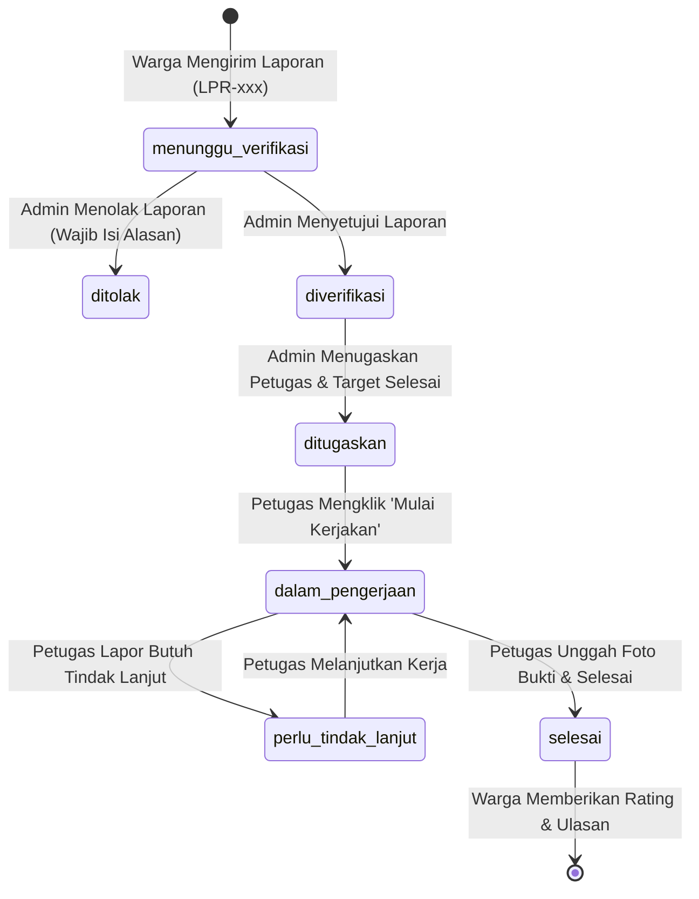

# Dokumentasi Teknis & Panduan Sistem - Laporin RT

Sistem **Laporin RT** adalah aplikasi layanan pengaduan masyarakat tingkat rukun tetangga berbasis web. Proyek ini mengimplementasikan pemisahan layanan fungsional menggunakan **Arsitektur Prosedural Modular (Strictly Non-MVC)** untuk web frontend, serta menyediakan arsitektur **Service Layer** untuk REST API backend (digunakan oleh aplikasi mobile/klien eksternal).

---

## 1. Spesifikasi Teknis Lingkungan (Environment)

Untuk memastikan aplikasi berjalan dengan andal tanpa kesalahan kompilasi, lingkungan server harus dikonfigurasi sebagai berikut:
* **Bahasa Pemrograman**: PHP versi **7.4.33** (MAMP / XAMPP kompatibel).
* **Kompatibilitas Sintaks**: Seluruh penangkapan error menggunakan `catch (Throwable $e)` wajib menangkap variabel ekspresi `$e`. Tidak menggunakan fitur eksklusif PHP 8+ seperti ekspresi `match` atau properti *constructor promotion*.
* **Basis Data**: MySQL 5.7+ / MariaDB 10.4+.
* **Autentikasi**: 
  * **Web Frontend**: Stateful session menggunakan native PHP `session` didukung sinkronisasi database aktif.
  * **Backend API**: Stateless session menggunakan JSON Web Token (JWT) HS256.

---

## 2. Struktur Direktori Lengkap & Penjelasan File

Aplikasi ini dibagi menjadi dua bagian utama: `backend/` untuk REST API dan `pages/` serta berkas root untuk sistem halaman web.

```text
uas_peweb_laporin/
│
├── backend/                            # LOGIKA BACKEND REST API
│   ├── controller/                     # Hapus (Sistem bebas MVC)
│   ├── db/
│   │   └── koneksi.php                 # Kelas Database Koneksi (Singleton & PDO Wrapper)
│   ├── errors/
│   │   └── ErrorHandler.php            # Handler penanganan error API global
│   ├── middleware/
│   │   └── AuthMiddleware.php          # Validasi JWT Token untuk akses API aman
│   ├── routes/
│   │   └── api.php                     # Mappings Endpoint & Autoloading Service API
│   ├── services/                       # Logika Fungsional API Backend (Stateless)
│   │   ├── admin/                      # Endpoint khusus manajemen admin
│   │   ├── petugas/                    # Endpoint tugas lapangan petugas
│   │   ├── rt/                         # Endpoint pengawasan ketua RT
│   │   └── users/                      # Endpoint registrasi, profil, & laporan warga
│   ├── sql/
│   │   └── uas_laporan.sql             # SQL Dump skema tabel, relasi, & dummy data
│   └── utils/
│       ├── codeGenerator.php           # Logika pembuatan ID unik (WRG-, PTG-, RT-, DRT-)
│       ├── jwtHelper.php               # Generator & verifikator Token JWT
│       ├── response.php                # Formatter respons JSON API terstandar
│       └── validator.php               # Validasi data masukan dari klien API
│
├── pages/                              # MODUL frontend web (Prosedural Modular)
│   ├── admin/
│   │   ├── admin_laporan.php           # Verifikasi laporan masuk & tugas petugas
│   │   └── admin_users.php             # Antarmuka tambah user & ubah role/status
│   ├── auth/                           # Inti Layanan Autentikasi Web (Service Layer)
│   │   ├── processors/                 # Handler Pemrosesan Request POST Form
│   │   │   ├── admin_processors.php    # Aksi admin (status laporan, edit/tambah/hapus user)
│   │   │   ├── auth_processors.php     # Aksi login email, register warga, reset password
│   │   │   ├── laporan_processors.php  # Aksi CRUD laporan aduan oleh warga
│   │   │   ├── petugas_processors.php  # Aksi petugas (mulai tugas, lapor progres, selesai)
│   │   │   └── rt_processors.php       # Aksi RT (tugaskan laporan, info wilayah)
│   │   ├── db_helpers.php              # Pengambil data SQL untuk disajikan ke halaman (Read)
│   │   ├── helpers.php                 # Utilitas CSRF, inisialisasi sesi, sidebar generator
│   │   └── page_renderers.php          # Pemuat visual file HTML/PHP
│   ├── petugas/
│   │   ├── petugas_riwayat.php         # Daftar riwayat pengerjaan laporan petugas
│   │   └── petugas_tugas.php           # Daftar penugasan aktif petugas lapangan
│   ├── rt/
│   │   ├── rt_darurat.php              # Tampilan peta & status laporan darurat
│   │   └── rt_monitoring.php           # Statistik performa & daftar kinerja petugas
│   ├── users/
│   │   ├── laporan_edit.php            # Form edit isi laporan warga
│   │   └── laporan_saya.php            # Daftar laporan yang dikirim oleh warga login
│   ├── auth.php                        # Pengendali rute pendaratan web (Entrypoint Web Router)
│   ├── dashboard.php                   # Tampilan Dashboard Utama lintas role (Bento-Grid Style)
│   ├── login.php                       # Tampilan Form Masuk dengan Email & Password Stacked
│   ├── register.php                    # Tampilan Form Daftar Akun Warga Baru
│   └── reset_password.php              # Tampilan Form Lupa Password terverifikasi NIK
│
├── index.php                           # Gerbang utama aplikasi (Web / API Router)
├── tailwind.config                     # Konfigurasi utility framework styling Tailwind CSS
└── DOKUMENTASI.md                      # Berkas dokumentasi ini
```

---

## 3. Matriks Fitur Berdasarkan Peran Pengguna (RBAC)

Sistem menggunakan kontrol akses berbasis peran (Role-Based Access Control). Berikut adalah matriks fiturnya:

| Fitur / Hak Akses | Warga | Ketua RT | Petugas | Administrator |
| :--- | :---: | :---: | :---: | :---: |
| **Login & Register Mandiri** | Ya | Tidak | Tidak | Tidak |
| **Reset Password via NIK** | Ya | Ya | Ya | Ya |
| **Kirim Aduan Kerusakan & Upload Foto** | Ya | Tidak | Tidak | Tidak |
| **Beri Rating & Ulasan Hasil Kerja** | Ya | Tidak | Tidak | Tidak |
| **Edit/Hapus Laporan Sendiri** | Ya | Tidak | Tidak | Tidak |
| **Lihat Dashboard Wilayah & Darurat** | Tidak | Ya | Tidak | Tidak |
| **Lihat Kinerja & Efisiensi Petugas** | Tidak | Ya | Tidak | Tidak |
| **Lihat Tugas Aktif & Unggah Progres** | Tidak | Tidak | Ya | Tidak |
| **Unggah Bukti Hasil Selesai Pengerjaan**| Tidak | Tidak | Ya | Tidak |
| **Verifikasi Laporan Masuk (Setuju/Tolak)**| Tidak | Tidak | Tidak | Ya |
| **Tugaskan Petugas & Set Target Selesai**| Tidak | Tidak | Tidak | Ya |
| **Kelola User (Tambah/Edit Peran/Hapus)** | Tidak | Tidak | Tidak | Ya |

---

## 4. Alur Siklus Hidup Laporan (Report Lifecycle Flow)

Mekanisme koordinasi pelaporan kerusakan dari warga hingga selesai dikerjakan oleh petugas lapangan mengikuti alur terstruktur berikut:



---

## 5. Keamanan & Manajemen Sesi (Session Checking)

Aplikasi menerapkan sistem perlindungan berlapis untuk menjamin keamanan akses data:

### A. Validasi Sesi Tunggal (Prevent Multiple Login)
Sistem membatasi satu akun hanya dapat aktif pada satu sesi browser saja.
1. **Pengecekan Rutin** ([pages/auth.php](file:///Applications/MAMP/htdocs/uas_peweb_laporin/pages/auth.php)):
   Saat user mengakses halaman web, kode berikut dijalankan untuk memverifikasi token sesi:
   ```php
   $activeSession = $db->query(
       "SELECT id FROM user_sessions WHERE user_id = ? AND session_token = ? AND is_active = 1 AND expired_at >= NOW() LIMIT 1",
       [$userId, $sessionId]
   )->fetch();
   if (!$activeSession) {
       unset($_SESSION['auth_user']);
       $_SESSION['session_error'] = 'Sesi berakhir karena tidak ada aktivitas atau login di perangkat lain.';
       redirectTo('/login');
   }
   ```
2. **Penimpaan Sesi** ([pages/auth/processors/auth_processors.php](file:///Applications/MAMP/htdocs/uas_peweb_laporin/pages/auth/processors/auth_processors.php)):
   Ketika terdeteksi aktivitas login baru, seluruh sesi lama milik user tersebut pada database akan diubah statusnya menjadi tidak aktif (`is_active = 0`). Sehingga perangkat lama akan ter-logout otomatis pada request berikutnya.

### B. Proteksi CSRF (Cross-Site Request Forgery)
Semua form input dengan metode `POST` diproteksi secara unik menggunakan token CSRF. Token ini di-generate secara acak saat user membuka halaman, disimpan ke dalam `$_SESSION['csrf_token']`, dan divalidasi ketat di fungsi `verifyCsrfToken()` sebelum form diproses:
```php
function verifyCsrfToken(): void
{
    $token = $_POST['csrf_token'] ?? $_SERVER['HTTP_X_CSRF_TOKEN'] ?? '';
    if ($token === '' || $token !== ($_SESSION['csrf_token'] ?? '')) {
        throw new RuntimeException('Token keamanan (CSRF) tidak cocok atau sudah kadaluwarsa.');
    }
}
```

### C. Hashing Kata Sandi
Kata sandi pengguna disandikan menggunakan fungsi BCRYPT bawaan PHP (`PASSWORD_BCRYPT` dengan cost/tingkat kesulitan penguraian 10). Ini memastikan bahwa sekalipun database bocor, kata sandi asli pengguna tidak dapat dibaca karena proses enkripsi satu arah (*one-way hash*).

---

## 6. Cara Kerja Generator Kode Unik & Keunikan Database

Untuk menjamin keaslian identitas data transaksi dan mencegah error duplikasi data (*integrity constraint*), sistem memanggil `CodeGenerator` pada model pembuatan data.

### A. Format Kode Identitas
* **Laporan Kerusakan**: `LPR-YYYYMM-XXXXX` (Contoh: `LPR-202606-00001` - Berisi informasi tahun dan bulan pelaporan dibuat).
* **Akun Warga**: `WRG-XXX` (Contoh: `WRG-001`).
* **Akun Ketua RT**: `RT-XXX` (Contoh: `RT-001`).
* **Akun Petugas**: `PTG-XXXXX` (Contoh: `PTG-00001`).
* **Akun Administrator**: `DRT-XXXXX` (Contoh: `DRT-00001`).

### B. Loop Validasi Unik Real-time
Guna menghindari bentrokan saat penambahan data bersamaan, dipasang fungsi `do-while` untuk mendeteksi ketersediaan kode:
```php
public function rtCode(): string
{
    do {
        $code = 'RT-' . str_pad((string)$this->nextCounter('counter_rt'), 3, '0', STR_PAD_LEFT);
        $exists = $this->db->query("SELECT id FROM users WHERE kode_user = ? LIMIT 1", [$code])->fetch();
    } while ($exists);
    return $code;
}
```

---

## 7. Aturan Penghapusan User (Conditional Deletion)

Aplikasi memiliki proteksi integritas data saat menghapus pengguna:
* **Pembatasan Relasi Aktif**: Admin tidak diijinkan menghapus akun Warga, RT, atau Petugas yang berstatus `aktif` atau `pending` apabila mereka masih tercatat memiliki kontribusi laporan pengaduan/penugasan aktif. Ini demi mencegah putusnya data laporan lama di sistem.
* **Penghapusan Paksa Akun Nonaktif**: Jika akun pengguna sudah dinonaktifkan terlebih dahulu (Status diubah ke **`nonaktif`**), sistem mengizinkan penghapusan paksa. Seluruh relasi kunci asing dinonaktifkan sementara agar user bisa dihapus bersih:
  ```php
  if ($target['status_akun'] === 'nonaktif') {
      $db->query("SET FOREIGN_KEY_CHECKS = 0");
      $db->query("DELETE FROM users WHERE id = ?", [$userId]);
      $db->query("DELETE FROM profil_warga WHERE user_id = ?", [$userId]);
      $db->query("SET FOREIGN_KEY_CHECKS = 1");
  }
  ```
* **Kotak Dialog Konfirmasi**: Tombol hapus dilengkapi dengan validasi konfirmasi bawaan browser JavaScript: `onsubmit="return confirm('apakah user mau dihapus?');"`.

---

## 8. Isi Berkas Lengkap & Penjelasan Kode Teknis (File Contents Manual)

Berikut penjelasan kode teknis, tandatangan fungsi, parameter, serta isi fungsional dari seluruh file yang ada di dalam project.

### A. Lapisan API Backend (`backend/`)

#### 1. Koneksi PDO Wrapper (`backend/db/koneksi.php`)
* **Namespace**: `App\Db`
* **Implementasi Kelas**: `class Database`
* **Isi Fungsional & Method**:
  * Menggunakan Pola Singleton untuk melimitasi koneksi aktif MySQL.
  * `public static function getInstance(): self` -> Instansiasi tunggal objek koneksi database.
  * `public function pdo(): \PDO` -> Mengembalikan koneksi PDO murni (raw connection).
  * `public function query(string $sql, array $params = []): \PDOStatement` -> Membuka transaksi *safe-prepare*, mengeksekusi parameter, dan mengembalikan `PDOStatement` untuk manipulasi baris (`fetchAll`, `fetchColumn`).
  * `public function beginTransaction(): bool`, `public function commit(): bool`, `public function rollback(): bool` -> Manajemen ACID transaksi database MySQL.

#### 2. Penangan Error Central (`backend/errors/ErrorHandler.php`)
* **Isi Fungsional**:
  * `public static function register(): void` -> Menghubungkan error PHP (`E_ALL`, `E_NOTICE`, `E_PARSE`) ke fungsi callback internal.
  * `public static function handleException(\Throwable $e): void` -> Format JSON response terstandar dengan *HTTP Status Code 500* jika terjadi *crash* runtime di backend API.

#### 3. Keamanan API JWT (`backend/middleware/AuthMiddleware.php`)
* **Isi Fungsional**:
  * `public static function authenticate(): array` -> Memeriksa header request HTTP `HTTP_AUTHORIZATION`. Mendekode token JWT dengan signature key. Mengembalikan array data pengguna login jika valid, atau menyetop alur dengan error 401.

#### 4. Pemeta Rute API (`backend/routes/api.php`)
* **Isi Fungsional**:
  * Membagi routing berdasarkan prefix API (seperti `/api/users/login`, `/api/users/register`, `/api/laporan`, dll.).
  * Mengimpor kelas Service API yang dipanggil secara dinamis berdasarkan method POST/GET.

#### 5. Utilitas System (`backend/utils/`)
* **codeGenerator.php**:
  * Memuat kelas `CodeGenerator`.
  * `public function rtCode(): string` -> Mengembalikan string `'RT-'` diikuti 3 digit konsekutif kependudukan.
  * `public function wargaCode(): string` -> Mengembalikan string `'WRG-'` diikuti 3 digit konsekutif kependudukan.
  * `public function petugasCode(): string` -> Mengembalikan string `'PTG-'` diikuti 5 digit konsekutif.
  * `public function adminCode(): string` -> Mengembalikan string `'DRT-'` diikuti 5 digit konsekutif.
  * `private function nextCounter(string $key): int` -> Menambah nilai kunci counter numerik di tabel konfigurasi dan mengambil hasil barunya secara aman.
* **jwtHelper.php**:
  * `public static function generate(array $payload): string` -> Membuat token JWT dengan payload (ID, nama, role) terenkripsi HS256.
  * `public static function decode(string $token): ?array` -> Validasi waktu kedaluwarsa JWT dan integrity token.
* **response.php**:
  * `public static function success(string $message, $data = null, int $code = 200): void` -> Mengeluarkan JSON response sukses.
  * `public static function error(string $message, int $code = 400): void` -> Mengeluarkan JSON response error.
* **validator.php**:
  * `public function required(string $field, string $label): self` -> Validasi data wajib diisi.
  * `public function nik(): self` -> Validasi pola NIK wajib berisi 16 digit numerik murni.

#### 6. Logika Fungsional API (`backend/services/`)
Setiap berkas merupakan kelas Service mandiri yang memproses logika data terisolasi.
* **users/LoginService.php**: Melakukan pencarian data user berdasarkan NIK, verifikasi password menggunakan `password_verify()`, dan mengembalikan token JWT jika login sukses.
* **users/RegisterService.php**: Memproses pendaftaran warga baru dengan status akun `'pending'` menunggu verifikasi admin.
* **users/LaporanService.php**: Menampung data laporan kerusakan yang dikirimkan warga, melakukan upload file foto bukti awal ke direktori lokal, dan menyimpannya ke tabel `laporan_kerusakan`.
* **petugas/TugasService.php**: Mengontrol status penugasan lapangan yang didelegasikan ke petugas. Petugas dapat menyetujui tugas, melapor progres perbaikan, dan menandai tugas telah rampung.
* **rt/DashboardService.php**: Menampilkan statistik laporan bertipe tingkat prioritas `'darurat'` di wilayah RT tempat ketua RT bertugas.

---

### B. Lapisan Web Frontend (`pages/`)

Logika frontend berjalan secara prosedural modular.

#### 1. Central Web Router (`pages/auth.php`)
* **Isi Fungsional & Logika Rute**:
  * `session_start()` dipanggil paling awal.
  * Memproses parameter URL Path dari request `authCurrentPath()`.
  * Memproses rute web berbasis alias (didefinisikan di `normalizeWebAuthPath()`):
    * `/login` -> Memanggil renderer `login.php`.
    * `/register` -> Memanggil renderer `register.php`.
    * `/reset-password` -> Memanggil renderer `reset_password.php`.
    * `/dashboard` -> Memanggil renderer `dashboard.php`.
    * `/admin-users` -> Mengeksekusi `processAdminUserForm()` saat form dikirimkan, lalu merender `pages/admin/admin_users.php`.
    * `/admin-laporan` -> Mengeksekusi `processAdminLaporanForm()`, lalu merender `pages/admin/admin_laporan.php`.
    * `/rt-monitoring` -> Merender `pages/rt/rt_monitoring.php`.
    * `/petugas-tugas` -> Merender `pages/petugas/petugas_tugas.php`.
    * `/logout` -> Menghapus data sesi dari tabel `user_sessions`, unset `$_SESSION['auth_user']`, lalu mengalihkan halaman ke `/login`.

#### 2. Form Request Processors (`pages/auth/processors/`)
* **admin_processors.php**:
  * `processAdminUserForm()` -> Mengarahkan aksi form user ke tambah user, hapus user, atau ubah status & role.
  * `processAdminCreateUserForm()` -> Logika pembuatan user oleh admin. Men-generate kode user secara dinamis (RT, PTG, DRT, WRG) dan menyimpannya di tabel database.
  * `processAdminUserStatusForm()` -> Mengupdate role/status akun di database. Jika warga ditingkatkan menjadi RT, secara otomatis kode user diubah dari `WRG-` menjadi `RT-`.
  * `processAdminDeleteUserForm()` -> Melakukan pengecekan status akun. Jika statusnya `nonaktif`, user akan dihapus paksa menggunakan `SET FOREIGN_KEY_CHECKS = 0`.
* **auth_processors.php**:
  * `processLoginForm()` -> Memverifikasi email dan kata sandi warga. Jika benar, menonaktifkan seluruh token lama milik user di tabel `user_sessions`, menginisialisasi PHP `session_id()` baru, dan menyimpannya di database sebagai sesi aktif.
  * `processRegisterForm()` -> Memproses pendaftaran warga mandiri dengan sandi yang terenkripsi dan penulisan kode warga `WRG-` otomatis.
  * `processResetPasswordForm()` -> Melakukan pencocokan NIK kependudukan warga sebelum memperbarui password baru.

#### 3. Tampilan Halaman HTML (`pages/`)
* **login.php**: Halaman form login dengan email & password terstruktur vertikal menggunakan styling grid Tailwind CSS yang responsif.
* **register.php**: Form registrasi akun warga dengan tumpukan input vertikal yang ramah untuk tampilan mobile / smartphone.
* **reset_password.php**: Form pemulihan password warga mandiri berbasis NIK.
* **dashboard.php**: Halaman panel dashboard utama responsif Bento-lite. Menampilkan total metrics card, chart porsi penanganan laporan, status pengerjaan petugas, serta log aktivitas user sesuai hak akses login masing-masing.
* **admin/admin_users.php**: Tabel responsif data kependudukan user di sistem. Menyediakan modal popup Tambah User, select-box untuk merubah Role dan Status secara instan, serta tombol hapus dengan konfirmasi dialog browser `"apakah user mau dihapus?"`.
* **admin/admin_laporan.php**: Antarmuka bagi admin untuk melihat laporan kerusakan dari warga, menyetujui, menolak dengan kolom alasan, dan memilih petugas lapangan untuk ditugaskan.
